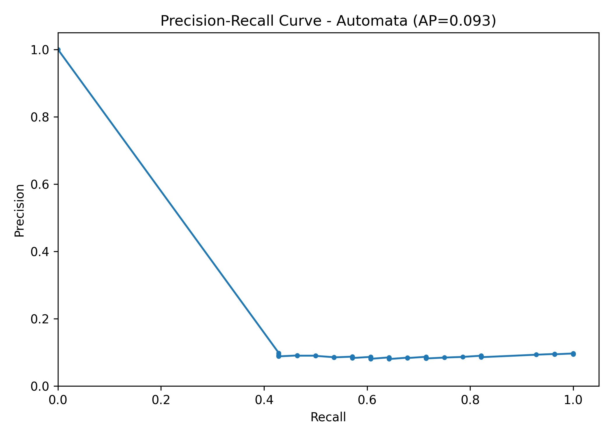
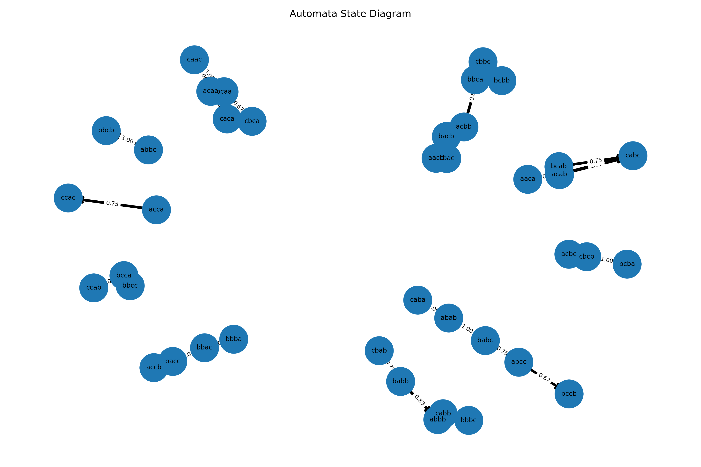
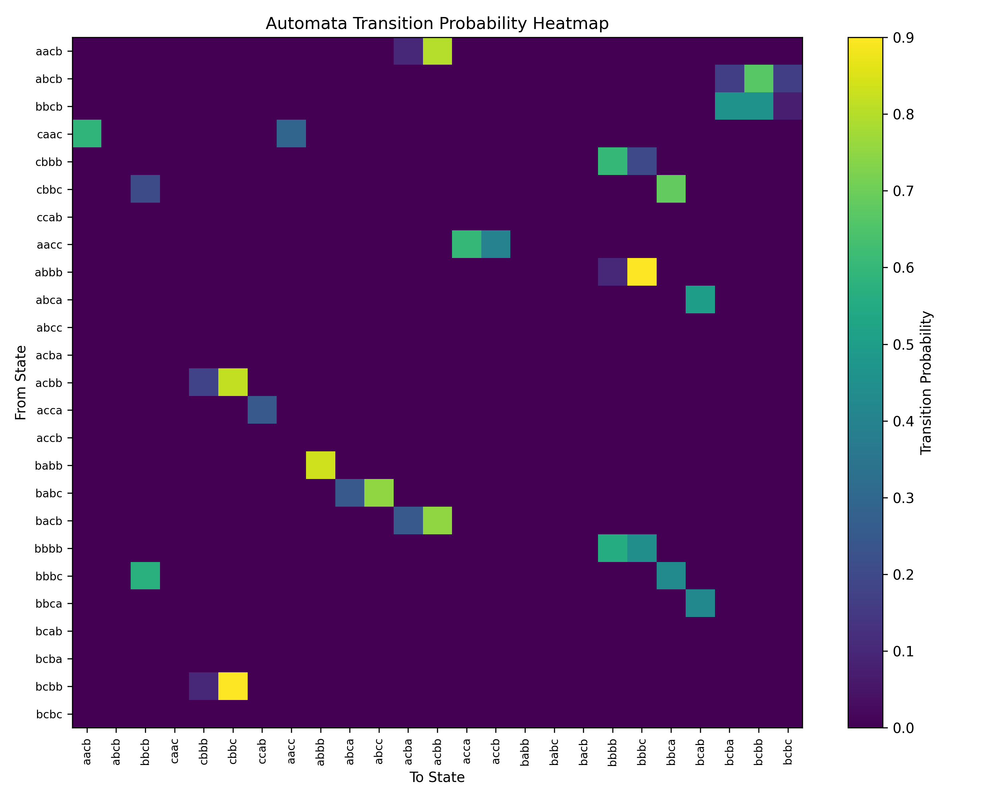
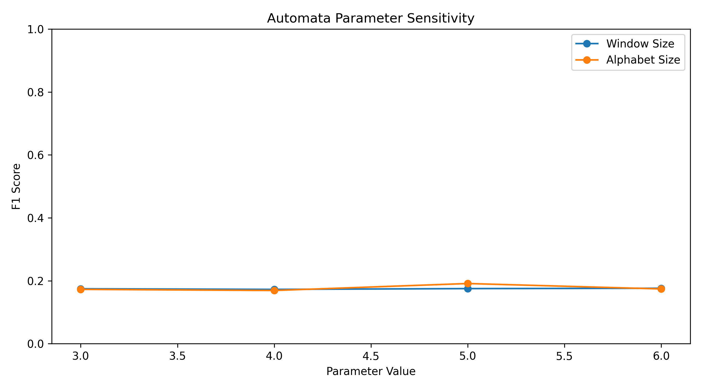

# Yazılım Geliştirme Laboratuvarı - 2. Proje 
## From Black-Box to Explainability: Probabilistic Automata for Time Series Analysis

**Grup 30 - İrem Karayel & Melike Sari**

Bu projede endüstriyel zaman serisi verileri üzerinde anomali tespiti yapılmıştır. Çalışmada derin öğrenme tabanlı **LSTM** ve **GRU** modelleri ile açıklanabilirlik odaklı **Olasılıksal Otomata** yaklaşımı karşılaştırılmıştır.

Projenin temel amacı yalnızca en yüksek başarı değerini veren modeli seçmek değildir. Asıl amaç; farklı model türlerinin zaman serisi anomalileri karşısındaki davranışlarını sistematik olarak analiz etmek, gürültü ve görülmemiş örüntülere karşı dayanıklılıklarını incelemek ve otomata yaklaşımı ile kararları açıklanabilir hale getirmektir.

---

## İçindekiler

1. [Proje Amacı](#proje-amacı)
2. [Kullanılan Veri Setleri](#kullanılan-veri-setleri)
3. [Proje Klasör Yapısı](#proje-klasör-yapısı)
4. [Kullanılan Yöntemler](#kullanılan-yöntemler)
5. [Ön İşleme Adımları](#ön-işleme-adımları)
6. [Model Mimarileri](#model-mimarileri)
7. [Olasılıksal Otomata Yaklaşımı](#olasılıksal-otomata-yaklaşımı)
8. [Deney Kurulumu](#deney-kurulumu)
9. [Model Karşılaştırmaları](#model-karşılaştırmaları)
10. [Model Performansı ve Stabilite](#model-performansı-ve-stabilite)
11. [Veri Setleri Arası Performans Farkları](#veri-setleri-arası-performans-farkları)
12. [Gürültü Etkisi Analizi](#gürültü-etkisi-analizi)
13. [Unseen Veri Davranışı](#unseen-veri-davranışı)
14. [Parametre Etkileri](#parametre-etkileri)
15. [Görseller](#görseller)
16. [Genel Değerlendirme](#genel-değerlendirme)
17. [Çalıştırma Adımları](#çalıştırma-adımları)
18. [Test Sonuçları](#test-sonuçları)
19. [Sonuç](#sonuç)

---

## Proje Amacı

Endüstriyel sistemlerden elde edilen sensör verileri zaman serisi yapısındadır. Bu zaman serilerindeki anormal davranışlar; sistem arızası, siber saldırı, beklenmeyen proses değişimi veya güvenlik riski gibi durumları gösterebilir.

Bu proje kapsamında aşağıdaki sorulara cevap aranmıştır:

* LSTM ve GRU gibi black-box derin öğrenme modelleri anomali tespitinde nasıl performans göstermektedir?
* Açıklanabilir Olasılıksal Otomata modeli derin öğrenme modellerine göre nasıl davranmaktadır?
* Otomata modeli verdiği kararları state geçişleri ve path probability üzerinden açıklayabilir mi?
* Gürültü eklenmiş verilerde model performansı nasıl değişmektedir?
* Eğitimde görülmemiş sembolik örüntüler karşısında otomata modeli nasıl karar vermektedir?
* Window size ve alphabet size gibi otomata parametreleri model davranışını nasıl etkilemektedir?

---

## Kullanılan Veri Setleri

Projede iki farklı endüstriyel zaman serisi veri seti ele alınmıştır:

* **BATADAL**
* **SKAB**

### BATADAL

BATADAL veri seti su dağıtım sistemine ait çok değişkenli zaman serisi verilerinden oluşmaktadır. Projede BATADAL için **Training Dataset 2** kullanılmıştır.

BATADAL veri setinde kullanılan temel sütunlar:

| Sütun                  | Açıklama                      |
| ---------------------- | ----------------------------- |
| `DATETIME`             | Zaman bilgisi                 |
| `ATT_FLAG`             | Saldırı/anomali etiketi       |
| Diğer 43 sayısal sütun | Sensör ve sistem değişkenleri |

Etiket dönüşümü:

| Orijinal Etiket | Dönüştürülen Etiket | Anlamı            |
| --------------: | ------------------: | ----------------- |
|            -999 |                   0 | Normal            |
|               1 |                   1 | Anomali / saldırı |

BATADAL veri seti zaman sırası korunarak bölünmüştür.

| Bölüm      | Oran | Satır Sayısı |
| ---------- | ---: | -----------: |
| Train      |  %60 |         2506 |
| Validation |  %20 |          835 |
| Test       |  %20 |          836 |

Hedef dağılımları:

| Bölüm      | Normal | Anomali |
| ---------- | -----: | ------: |
| Train      |   2404 |     102 |
| Validation |    798 |      37 |
| Test       |    756 |      80 |

---

### SKAB

SKAB veri setinde yalnızca proje kapsamında istenen `valve1` ve `valve2` klasörleri kullanılmıştır.

SKAB tarafında yapılan işlemler:

* Sadece `valve1` ve `valve2` klasörleri okunmuştur.
* CSV dosyaları `;` ayıracı ile okunmuştur.
* Tüm CSV dosyaları tek bir DataFrame altında birleştirilmiştir.
* `source_group` sütunu eklenmiştir.
* `source_file` sütunu eklenmiştir.
* `anomaly` hedef değişken olarak kullanılmıştır.
* `datetime`, `changepoint`, `source_group`, `source_file` ve `anomaly` model girdisine dahil edilmemiştir.
* Aynı CSV dosyasına ait satırların hem train hem test tarafına düşmesini engellemek için `GroupKFold` kullanılmıştır.

SKAB veri seti üzerinde temel yükleme, hedef değişken ayırma ve dosya bazlı fold kontrolü yapılmıştır. Böylece veri sızıntısı engellenmiştir.

---

## Proje Klasör Yapısı

```text
YazLab2/
│
├── .gitignore
├── config.yaml
├── inspect_batadal.py
├── main_check.py
├── README.md
├── requirements.txt
│
├── data/
│   └── raw/
│       ├── BATADAL/
│       │   └── batadal_training_dataset_2.csv
│       └── SKAB/
│           ├── valve1/
│           └── valve2/
│
├── results/
│   ├── metrics/
│   ├── figures/
│   └── explanations/
│
├── src/
│   ├── automata/
│   │   ├── explainability.py
│   │   ├── levenshtein.py
│   │   ├── paa.py
│   │   ├── sax.py
│   │   └── transition_matrix.py
│   │
│   ├── config/
│   │   └── config_loader.py
│   │
│   ├── data/
│   │   ├── load_batadal.py
│   │   ├── load_skab.py
│   │   └── split_data.py
│   │
│   ├── experiments/
│   │   ├── generate_figures.py
│   │   ├── run_automata.py
│   │   ├── run_gru.py
│   │   ├── run_lstm.py
│   │   ├── test_gru_model.py
│   │   └── test_skab_loader.py
│   │
│   ├── models/
│   │   ├── automata_model.py
│   │   ├── gru_model.py
│   │   └── lstm_model.py
│   │
│   ├── preprocessing/
│   │   ├── noise.py
│   │   ├── pca_transformer.py
│   │   ├── scaler.py
│   │   └── windowing.py
│   │
│   └── utils/
│       ├── logger.py
│       ├── metrics.py
│       ├── seed.py
│       └── visualization.py
│
└── tests/
    ├── test_automata_model.py
    ├── test_automata_unseen.py
    ├── test_explainability.py
    ├── test_levenshtein.py
    ├── test_paa.py
    ├── test_sax.py
    └── test_transition_matrix.py
```

---

## Kullanılan Yöntemler

Projede kullanılan temel yöntemler:

* StandardScaler
* PCA
* Sliding Window
* LSTM
* GRU
* PAA
* SAX
* Levenshtein Distance
* Probabilistic Automata
* Validation-based threshold tuning
* GroupKFold
* Gaussian noise
* JSON tabanlı deney kaydı
* Confusion matrix
* Precision-Recall curve
* Transition probability heatmap
* Automata state diagram
* Parametre duyarlılık analizi

---

## Ön İşleme Adımları

### 1. Normalizasyon

Sayısal değişkenler `StandardScaler` ile normalize edilmiştir. Veri sızıntısını engellemek için scaler yalnızca train verisi üzerinde fit edilmiştir. Validation ve test verileri aynı scaler ile dönüştürülmüştür.

### 2. PCA

Otomata modeli tek boyutlu veri üzerinde çalıştığı için çok değişkenli sensör verileri PCA ile tek boyuta indirilmiştir. Bu projede `pca_components = 1` kullanılmıştır.

### 3. Sequence Oluşturma

LSTM ve GRU modelleri için zaman pencereleri oluşturulmuştur. `sequence_length = 20` olarak alınmıştır. Her pencerenin hedef etiketi, pencerenin son zaman adımındaki etiket olarak belirlenmiştir.

### 4. Gaussian Noise

Gürültü etkisini analiz etmek amacıyla veriye Gaussian noise ekleme fonksiyonu hazırlanmıştır. Gürültü ekleme işlemi robustness analizi için kullanılmıştır.

---

## Model Mimarileri

### LSTM

LSTM modeli aşağıdaki yapıya sahiptir:

* Input layer
* LSTM layer, 64 unit
* Dropout, 0.30
* Dense layer, 32 neuron, ReLU
* Dropout, 0.30
* Dense layer, 1 neuron, Sigmoid

LSTM modeli binary anomaly detection için `binary_crossentropy` loss fonksiyonu ile eğitilmiştir. Sınıf dengesizliği nedeniyle class weight kullanılmıştır. Validation set üzerinde F1-score değerini iyileştirmek için threshold tuning yapılmıştır. Early stopping, validation AUC değerine göre uygulanmıştır.

---

### GRU

GRU modeli aşağıdaki yapıya sahiptir:

* Input layer
* GRU layer, 64 unit
* Dropout, 0.30
* Dense layer, 32 neuron, ReLU
* Dropout, 0.30
* Dense layer, 1 neuron, Sigmoid

GRU modeli de binary anomaly detection için oluşturulmuştur. Validation threshold tuning ve çoklu seed değerlendirmesi GRU için de uygulanmıştır.

---

### Olasılıksal Otomata

Otomata modelinde aşağıdaki akış uygulanmıştır:

```text
Zaman serisi
→ PCA ile PC1
→ PAA
→ SAX
→ Sliding Window Pattern
→ State geçişleri
→ Transition Probability
→ Path Probability
→ Normal / Anomaly kararı
```

Her benzersiz pattern bir state olarak kabul edilmiştir. State geçiş olasılıkları eğitim verisi üzerinden hesaplanmıştır.

Bir pattern dizisinin olasılığı aşağıdaki gibi hesaplanmıştır:

```text
P(path) = P(S1 → S2) × P(S2 → S3) × ... × P(Sn-1 → Sn)
```

Path probability belirlenen threshold değerinden küçükse ilgili örnek anomali olarak değerlendirilmiştir.

---

## Olasılıksal Otomata Yaklaşımı

Otomata modelinin temel avantajı açıklanabilir olmasıdır. LSTM ve GRU modelleri black-box yapıda olduğu için kararlarını doğrudan yorumlamak zordur. Olasılıksal otomata modeli ise state geçişleri ve geçiş olasılıkları üzerinden karar üretir.

Model her karar için aşağıdaki bilgileri üretmektedir:

* time step
* current state
* observed pattern
* seen / unseen durumu
* mapped pattern
* Levenshtein distance
* transition details
* path probability
* anomaly threshold
* decision
* confidence score

Örnek açıklama çıktısı:

```json
{
  "time_step": 0,
  "state": "bacb",
  "pattern": "ccba",
  "status": "unseen",
  "mapped_to": "acba",
  "probability": 0.4,
  "path_probability": 0.4,
  "anomaly_threshold": 0.4615,
  "decision": "anomaly",
  "confidence_score": 0.4,
  "levenshtein_distance": 1
}
```

Bu yapı sayesinde model yalnızca anomali kararı üretmemekte, kararın hangi geçiş olasılıklarına ve hangi sembolik örüntülere bağlı olduğunu da göstermektedir.

---

## Deney Kurulumu

Deneylerde kullanılan ortak ayarlar:

| Parametre                      |                 Değer |
| ------------------------------ | --------------------: |
| Random seed değerleri          | 42, 123, 2026, 7, 999 |
| Epoch üst sınırı               |                    50 |
| Batch size                     |                    32 |
| Early stopping patience        |                     5 |
| Sequence length                |                    20 |
| PCA component                  |                     1 |
| Automata default window size   |                     4 |
| Automata default alphabet size |                     3 |
| Automata n_segments            |                   300 |
| Automata sequence size         |                     3 |

Değerlendirme metrikleri:

* Accuracy
* Precision
* Recall
* F1-score
* Confusion Matrix

---

## Model Karşılaştırmaları

BATADAL veri seti üzerinde elde edilen genel sonuçlar aşağıdaki gibidir.

| Model    | Accuracy | Precision | Recall |    F1 |
| -------- | -------: | --------: | -----: | ----: |
| LSTM     |    0.945 |     0.697 |  0.620 | 0.633 |
| GRU      |    0.880 |     0.238 |  0.143 | 0.178 |
| Automata |    0.129 |     0.093 |  0.929 | 0.168 |

### Yorum

LSTM modeli BATADAL veri setinde en dengeli sonucu üretmiştir.

GRU modeli yapılan EarlyStopping ve threshold düzenlemelerinden sonra bazı seed değerlerinde anomali yakalayabilmiştir. Ancak ortalama F1-score değeri LSTM’e göre düşük kaldığı için daha kararsız bir davranış göstermiştir.

Olasılıksal otomata modeli yüksek recall değerine ulaşmıştır. Fakat çok fazla normal örneği de anomali olarak işaretlediği için precision değeri düşük kalmıştır.

---

## Model Performansı ve Stabilite

LSTM modeli 5 farklı random seed ile çalıştırılmıştır.

| Seed | Accuracy | Precision | Recall |    F1 | Selected Threshold | Epoch |
| ---: | -------: | --------: | -----: | ----: | -----------------: | ----: |
|   42 |    0.960 |     0.783 |  0.813 | 0.798 |               0.26 |     6 |
|  123 |    0.955 |     0.779 |  0.750 | 0.764 |               0.08 |     7 |
| 2026 |    0.949 |     0.839 |  0.588 | 0.691 |               0.18 |    10 |
|    7 |    0.967 |     0.785 |  0.913 | 0.844 |               0.38 |     6 |
|  999 |    0.897 |     0.300 |  0.038 | 0.067 |               0.50 |     6 |

LSTM ortalama ve standart sapma değerleri:

| Metrik    | Ortalama | Standart Sapma |
| --------- | -------: | -------------: |
| Accuracy  |    0.945 |          0.028 |
| Precision |    0.697 |          0.223 |
| Recall    |    0.620 |          0.346 |
| F1        |    0.633 |          0.321 |

### LSTM Stabilite Yorumu

LSTM modeli çoğu seed değerinde başarılı sonuç üretmiştir. Seed 999 değerinde performans düşse de genel ortalama bakımından en dengeli model olmuştur.

---

GRU modeli 5 farklı random seed ile çalıştırılmıştır.

| Seed | Accuracy | Precision | Recall |    F1 | Selected Threshold | Epoch |
| ---: | -------: | --------: | -----: | ----: | -----------------: | ----: |
|   42 |    0.909 |     0.560 |  0.350 | 0.431 |              0.402 |     7 |
|  123 |    0.901 |     0.000 |  0.000 | 0.000 |              0.089 |    12 |
| 2026 |    0.780 |     0.000 |  0.000 | 0.000 |              0.500 |     6 |
|    7 |    0.892 |     0.000 |  0.000 | 0.000 |              0.300 |     7 |
|  999 |    0.917 |     0.630 |  0.363 | 0.460 |              0.041 |     8 |

GRU ortalama ve standart sapma değerleri:

| Metrik    | Ortalama | Standart Sapma |
| --------- | -------: | -------------: |
| Accuracy  |    0.880 |          0.057 |
| Precision |    0.238 |          0.327 |
| Recall    |    0.143 |          0.195 |
| F1        |    0.178 |          0.244 |

### GRU Stabilite Yorumu

GRU modeli seed 42 ve seed 999 değerlerinde anomali yakalayabilmiştir. Diğer seedlerde F1-score sıfır kalmıştır. Bu nedenle GRU, BATADAL veri setinde LSTM’e göre daha kararsız sonuç üretmiştir.

---

## Veri Setleri Arası Performans Farkları

Bu projede iki farklı endüstriyel veri seti ele alınmıştır:

* BATADAL
* SKAB

BATADAL tarafında LSTM, GRU ve otomata deney akışları uygulanmıştır. SKAB tarafında ise `valve1` ve `valve2` klasörleri üzerinden veri yükleme, hedef değişken ayırma ve GroupKFold tabanlı leakage kontrolü yapılmıştır.

| Veri Seti | Kullanılan Bölme Stratejisi                      | Temel Gözlem                                                                                                                                |
| --------- | ------------------------------------------------ | ------------------------------------------------------------------------------------------------------------------------------------------- |
| BATADAL   | Zaman sıralı %60 train, %20 validation, %20 test | Sınıf dengesizliği belirgindir. LSTM en dengeli sonucu vermiştir. GRU bazı seedlerde anomali yakalayabilmiş, ancak daha kararsız kalmıştır. |
| SKAB      | `source_file` tabanlı GroupKFold                 | Aynı CSV dosyasının train ve test tarafına düşmesi engellenmiştir. Dosya bazlı genelleme hedeflenmiştir.                                    |

### Yorum

BATADAL veri seti zaman sıralı yapısı nedeniyle temporal genelleme açısından değerlendirilmiştir. SKAB veri setinde ise farklı dosyalara ait örüntülerin train/test ayrımında karışmaması önemli olduğu için GroupKFold tercih edilmiştir.

Bu nedenle iki veri setinin performansları doğrudan aynı bölme stratejisiyle karşılaştırılmamıştır. BATADAL’da zaman sıralı ayrım öne çıkarken, SKAB’de dosya bazlı genelleme öne çıkmıştır.

---

## Gürültü Etkisi Analizi

Projede gürültü etkisini analiz etmek için Gaussian noise ekleme fonksiyonu hazırlanmıştır.

Gürültü ekleme fonksiyonu:

```text
X_noisy = X + N(mean=0, std=0.05)
```

Gürültü senaryosunun amacı, modelin veri kalitesindeki düşüşe karşı ne kadar dayanıklı olduğunu incelemektir.

| Model    | Orijinal F1 | Gürültülü Veri Davranışı                                                                                                     |
| -------- | ----------: | ---------------------------------------------------------------------------------------------------------------------------- |
| LSTM     |       0.633 | Gürültülü veride performansın düşmesi beklenir; model sayısal sensör değerlerine duyarlıdır.                                 |
| GRU      |       0.178 | GRU modeli bazı seedlerde anomali yakalamıştır; ancak genel olarak kararsız olduğu için gürültüden daha fazla etkilenebilir. |
| Automata |       0.168 | Gürültü, SAX sembollerini ve state geçişlerini değiştirebilir; unseen/düşük olasılıklı pattern sayısı artabilir.             |

### Yorum

Gaussian noise, özellikle sensör değerlerine dayalı modellerin dayanıklılığını değerlendirmek için önemlidir. Derin öğrenme modelleri doğrudan sayısal değerlerle çalıştığı için gürültüden etkilenebilir. Olasılıksal otomata modelinde ise gürültü PAA ve SAX aşamalarında sembolik örüntülerin değişmesine yol açabilir.

---

## Unseen Veri Davranışı

Otomata modelinde test sırasında eğitimde görülmeyen pattern’lar `unseen` olarak işaretlenmiştir. Bu durumda model, Levenshtein distance kullanarak eğitim sözlüğündeki en yakın pattern’ı bulmaktadır.

Örnek:

| Test Pattern | En Yakın Eğitim Pattern | Levenshtein Distance |
| ------------ | ----------------------- | -------------------: |
| ccba         | acba                    |                    1 |

Unseen pattern geldiğinde sistem şu adımları uygular:

1. Pattern’ın eğitimde görülüp görülmediği kontrol edilir.
2. Eğitimde yoksa `unseen` olarak işaretlenir.
3. Levenshtein distance ile en yakın bilinen pattern bulunur.
4. Karar hesaplaması mapped pattern üzerinden yapılır.
5. Açıklama çıktısına hem orijinal hem de kullanılan pattern eklenir.

| Model    | Unseen Davranışı                       | Açıklama                                                     |
| -------- | -------------------------------------- | ------------------------------------------------------------ |
| LSTM     | Doğrudan unseen pattern kavramı yoktur | Sayısal zaman penceresi üzerinden tahmin yapar               |
| GRU      | Doğrudan unseen pattern kavramı yoktur | Sayısal zaman penceresi üzerinden tahmin yapar               |
| Automata | Levenshtein mapping kullanır           | Görülmemiş sembolik örüntüyü en yakın bilinen örüntüye eşler |

### Yorum

Unseen pattern yönetimi otomata modelinin açıklanabilirlik açısından güçlü yönlerinden biridir. Model, eğitimde görmediği bir örüntüyle karşılaştığında en yakın bilinen pattern’a eşleyerek karar sürecini sürdürebilmektedir.

---

## Parametre Etkileri

Otomata modelinde özellikle iki parametre önemlidir:

* Window size
* Alphabet size

Window size, kaç sembolün bir pattern oluşturacağını belirler. Alphabet size ise SAX dönüşümünde kaç farklı sembol kullanılacağını belirler.

Parametre duyarlılık analizi sonuçları:

| Parametre        | Değer 3 | Değer 4 | Değer 5 | Değer 6 |
| ---------------- | ------: | ------: | ------: | ------: |
| Window Size F1   |  0.1745 |  0.1725 |  0.1750 |  0.1761 |
| Alphabet Size F1 |  0.1725 |  0.1690 |  0.1911 |  0.1739 |

### Parametre Yorumu

Window size küçük olduğunda daha kısa pattern’lar oluşur. Window size büyüdüğünde daha uzun ve ayrıntılı pattern’lar elde edilir.

Alphabet size küçük olduğunda daha kaba sembolik temsil oluşur. Alphabet size büyüdükçe temsil hassaslaşır, ancak state sayısı ve geçiş matrisi karmaşıklığı artabilir.

Bu deneyde window size değerleri arasında büyük performans farkı oluşmamıştır. Alphabet size için en yüksek F1-score değeri 5 değerinde elde edilmiştir.

---

## Runtime Analizi

Modellerin çalışma süreleri aynı bilgisayar ortamında tek çalıştırma üzerinden ölçülmüştür. LSTM ve GRU için ilk random seed kullanılmıştır. Süreler saniye cinsindendir ve donanım özellikleri, TensorFlow optimizasyonları ve çalıştırma ortamına göre değişiklik gösterebilir.

| Model    | Training Time (sn) | Inference Time (sn) | Açıklama                                                                       |
| -------- | -----------------: | ------------------: | ------------------------------------------------------------------------------ |
| LSTM     |            10.6263 |              1.0075 | Tek seed üzerinden ölçülmüştür; class weight ve early stopping kullanılmıştır. |
| GRU      |            59.4049 |              0.3659 | Tek seed üzerinden ölçülmüştür; class weight kullanılmıştır.                   |
| Automata |             0.0001 |              0.0466 | Transition probability tablosu ve test pattern karar süresi ölçülmüştür.       |

### Runtime Yorumu

Automata modeli eğitim ve inference süresi açısından en hızlı modeldir. Bunun nedeni ağırlık öğrenmek yerine transition probability tablosu oluşturmasıdır.

LSTM modeli GRU’ya göre daha kısa eğitim süresiyle daha dengeli sonuç üretmiştir.

GRU modeli daha düşük inference süresine sahip olsa da performans ve stabilite bakımından LSTM’in gerisinde kalmıştır. Bu nedenle model değerlendirmesinde yalnızca runtime değil; accuracy, precision, recall, F1-score ve açıklanabilirlik birlikte ele alınmalıdır.

---

## Görseller

### Model Karşılaştırması

Aşağıdaki grafik LSTM, GRU ve Automata modellerinin BATADAL veri setindeki temel metriklerini karşılaştırmaktadır.


---

### Confusion Matrix

Aşağıdaki görsel otomata modelinin BATADAL test setindeki confusion matrix çıktısını göstermektedir.


---

### Precision-Recall Eğrisi

Anomali tespiti probleminde sınıf dengesizliği bulunduğu için Precision-Recall eğrisi ROC eğrisine göre daha anlamlı olabilir. Bu nedenle bu projede uygun görsel olarak Precision-Recall eğrisi kullanılmıştır.



---

### Automata State Diagram

Aşağıdaki görsel otomata modelinde oluşan state’leri ve state’ler arası geçişleri göstermektedir.



---

### Transition Probability Heatmap

Aşağıdaki heatmap, otomata modelinin öğrendiği transition probability değerlerini göstermektedir.



---

### Parametre Duyarlılık Grafiği

Aşağıdaki grafik window size ve alphabet size parametrelerinin F1-score üzerindeki etkisini göstermektedir.



---

### LSTM Seed Bazlı F1 Grafiği

Aşağıdaki grafik LSTM modelinin farklı seed değerlerinde elde ettiği F1-score değişimini göstermektedir.


---

### GRU Seed Bazlı F1 Grafiği

Aşağıdaki grafik GRU modelinin farklı seed değerlerinde elde ettiği F1-score değişimini göstermektedir.


---

## Genel Değerlendirme

Deney sonuçlarına göre LSTM modeli BATADAL veri seti üzerinde en dengeli sonucu üretmiştir. LSTM’in accuracy, precision, recall ve F1-score değerleri birlikte değerlendirildiğinde, bu modelin anomali tespitinde en başarılı genel performansı verdiği görülmüştür.

GRU modeli yapılan EarlyStopping ve threshold düzenlemelerinden sonra bazı seed değerlerinde anomali yakalayabilmiştir. Ancak ortalama F1-score değeri LSTM’e göre düşük kalmış ve bazı seedlerde F1-score sıfır olmuştur. Bu nedenle GRU modeli BATADAL veri setinde LSTM’e göre daha kararsız sonuç üretmiştir.

Olasılıksal otomata modeli ise farklı bir davranış göstermiştir. Automata modeli anomalilerin büyük kısmını yakalamış ve yüksek recall değerine ulaşmıştır. Ancak çok sayıda normal örneği de anomali olarak işaretlediği için precision değeri düşük kalmıştır. Bu durum otomata modelinin hassas fakat fazla alarm üreten bir yapı sergilediğini göstermektedir.

Otomata modelinin en önemli avantajı açıklanabilirliktir. LSTM ve GRU modelleri black-box yapıya sahipken, otomata modeli kararlarını state geçişleri, path probability ve unseen pattern mapping üzerinden açıklayabilmektedir. Bu nedenle otomata modeli yalnızca performans açısından değil, yorumlanabilirlik açısından da değerli bir yaklaşım sunmaktadır.

---

## Çalıştırma Adımları

### 1. Sanal Ortam Oluşturma

```bash
python -m venv .venv
```

Windows PowerShell için:

```bash
.venv\Scripts\activate
```

Aktif olduğunda terminal satırının başında şu ifade görünmelidir:

```text
(.venv)
```

---

### 2. Gerekli Paketleri Kurma

```powershell
python -m pip install -r requirements.txt
```

Ek olarak grafik ve automata state diagram üretimi için gerekirse şu paketler kurulabilir:

```powershell
python -m pip install matplotlib networkx
```

---

### 3. Veri Setlerinin Konumunu Kontrol Etme

BATADAL veri dosyası aşağıdaki konumda bulunmalıdır:

```text
data/raw/BATADAL/batadal_training_dataset_2.csv
```

SKAB veri seti aşağıdaki klasör yapısına uygun olmalıdır:

```text
data/raw/SKAB/valve1/
data/raw/SKAB/valve2/
```

PowerShell üzerinden hızlı kontrol:

```powershell
Test-Path data/raw/BATADAL/batadal_training_dataset_2.csv
Test-Path data/raw/SKAB/valve1
Test-Path data/raw/SKAB/valve2
```

Üç komutun da `True` dönmesi beklenir.

---

### 4. BATADAL Ön İşleme ve Veri Hazırlama Kontrolü

```powershell
python main_check.py
```

Bu komut BATADAL veri setini okur, zaman sıralı train/validation/test ayrımını yapar, model girdilerini hazırlar, normalizasyonu uygular, PCA dönüşümünü kontrol eder ve LSTM/GRU sequence verisini oluşturur.

---

### 5. SKAB Loader ve GroupKFold Kontrolü

```powershell
python -m src.experiments.test_skab_loader
```

Bu komut SKAB veri setinin `valve1` ve `valve2` klasörlerinden okunup okunmadığını ve `source_file` tabanlı GroupKFold ayrımında veri sızıntısı olup olmadığını kontrol eder.

---

### 6. Unit Testleri Çalıştırma

```powershell
python -m pytest
```

Bu komut PAA, SAX, transition probability, Levenshtein distance, unseen pattern mapping, explainability ve probabilistic automata model testlerini çalıştırır.

Beklenen çıktı:

```text
passed
```

---

### 7. LSTM Deneylerini Çalıştırma

```powershell
python -m src.experiments.run_lstm
```

Bu komut LSTM modelini 5 farklı random seed ile çalıştırır. Her seed için ayrı JSON sonuç dosyası oluşturulur ve en sonunda ortalama + standart sapma sonuçları kaydedilir.

Oluşan temel dosyalar:

```text
results/metrics/batadal_lstm_seed_42.json
results/metrics/batadal_lstm_seed_123.json
results/metrics/batadal_lstm_seed_2026.json
results/metrics/batadal_lstm_seed_7.json
results/metrics/batadal_lstm_seed_999.json
results/metrics/batadal_lstm_summary_all_seeds.json
```

---

### 8. GRU Deneylerini Çalıştırma

```powershell
python -m src.experiments.run_gru
```

Bu komut GRU modelini 5 farklı random seed ile çalıştırır. GRU eğitiminde validation AUC tabanlı EarlyStopping ve validation set üzerinden threshold seçimi uygulanır.

Oluşan temel dosyalar:

```text
results/metrics/batadal_gru_seed_42.json
results/metrics/batadal_gru_seed_123.json
results/metrics/batadal_gru_seed_2026.json
results/metrics/batadal_gru_seed_7.json
results/metrics/batadal_gru_seed_999.json
results/metrics/batadal_gru_summary_all_seeds.json
```

---

### 9. Automata Deneyini Çalıştırma

```powershell
python -m src.experiments.run_automata
```

Bu komut BATADAL verisi üzerinde PCA, PAA, SAX, sliding window, transition probability ve path probability akışını çalıştırır. Validation set üzerinden threshold seçilir ve test setinde automata modeli değerlendirilir.

Oluşan temel dosya:

```text
results/metrics/batadal_automata_result.json
```

---

### 10. Rapor Görsellerini Üretme

```powershell
python -m src.experiments.generate_figures
```

Bu komut README raporunda kullanılan tüm grafik dosyalarını üretir.

---

### 11. Runtime Analizi Çalıştırma

```powershell
python -m src.experiments.measure_runtime
```

Bu komut LSTM, GRU ve Automata modelleri için training time ve inference time ölçümü yapar. Runtime sonuçları aşağıdaki dosyaya kaydedilir:

```text
results/metrics/runtime_summary.json
```

Not: Runtime ölçümleri donanım ve çalışma ortamına göre değişebilir. README’deki runtime tablosu belirli bir lokal çalıştırma sonucuna göre raporlanmıştır.

---

### 12. Hızlı Demo

Tüm sistemi baştan sona göstermek gerekirse aşağıdaki sıra kullanılabilir:

```powershell
python main_check.py
python -m src.experiments.test_skab_loader
python -m pytest
python -m src.experiments.run_automata
python -m src.experiments.generate_figures
```

LSTM ve GRU 5 seed eğitimleri daha uzun sürebileceği için sunumda özellikle istenirse ayrıca çalıştırılabilir:

```powershell
python -m src.experiments.run_lstm
python -m src.experiments.run_gru
```

---

### 13. Tam Deney Akışını Baştan Çalıştırma

Tüm deneyleri baştan üretmek için aşağıdaki komutlar sırayla çalıştırılabilir:

```powershell
python main_check.py
python -m src.experiments.test_skab_loader
python -m pytest
python -m src.experiments.run_lstm
python -m src.experiments.run_gru
python -m src.experiments.run_automata
python -m src.experiments.generate_figures
```

Runtime sonuçlarını da yeniden üretmek istenirse en sona şu komut eklenebilir:

```powershell
python -m src.experiments.measure_runtime
```
---

## Test Sonuçları

Projede otomata modelinin temel bileşenleri için unit testler hazırlanmıştır.

Test edilen bileşenler:

* PAA
* SAX
* Sliding Window
* Transition Probability
* Path Probability
* Levenshtein Distance
* Unseen Pattern Mapping
* Explainability
* Probabilistic Automata Model

Test komutu:

```bash
python -m pytest
```

Beklenen çıktı:

```text
19 passed
```

---

## Sonuç

Bu projede black-box derin öğrenme modelleri ile açıklanabilir olasılıksal otomata yaklaşımı karşılaştırılmıştır. LSTM modeli BATADAL veri setinde en dengeli performansı üretmiştir. GRU modeli bazı seed değerlerinde anomali yakalayabilmiş, ancak genel performans ve stabilite bakımından LSTM’in gerisinde kalmıştır. Olasılıksal otomata modeli ise yüksek recall değerine ulaşmış, ancak fazla false alarm üretmiştir.

Genel olarak proje; model performansını yalnızca tek bir başarı metriği üzerinden değil, stabilite, gürültü dayanıklılığı, unseen veri davranışı, parametre etkisi, runtime ve açıklanabilirlik açısından değerlendirmeyi amaçlamıştır.
