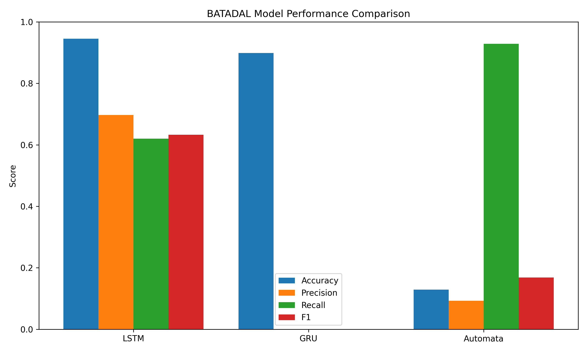
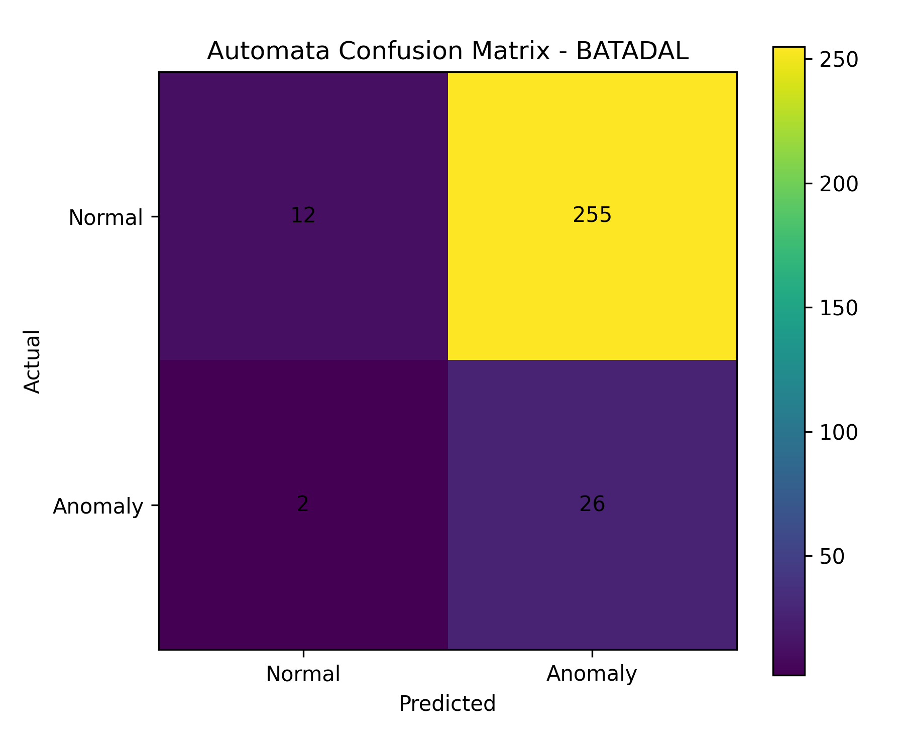
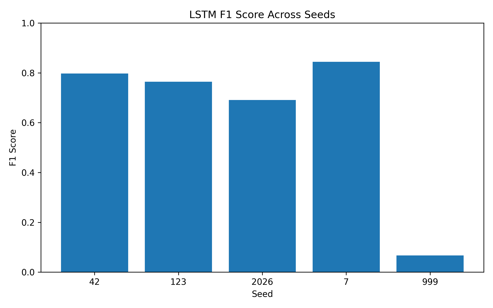
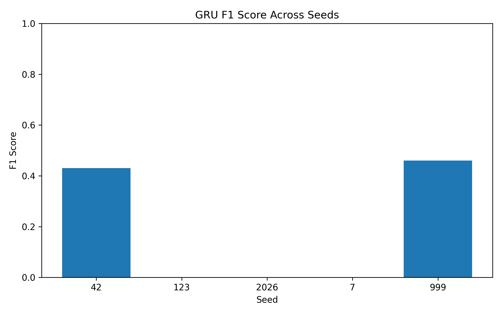

# YazLab2 – Endüstriyel Anomali Tespiti

Bu projede endüstriyel sistemlerden elde edilen zaman serisi verileri kullanılarak anomali tespiti yapılmıştır. Çalışmada derin öğrenme tabanlı **LSTM** ve **GRU** modelleri ile açıklanabilir **Olasılıksal Otomata** yaklaşımı karşılaştırılmıştır.

## Proje Amacı

Amaç, farklı modelleme yaklaşımlarının zaman serisi tabanlı anomali tespiti probleminde nasıl davrandığını incelemektir.

## Kullanılan Yöntemler

- PAA
- SAX
- Sliding Window
- Levenshtein Distance
- Olasılıksal Otomata
- LSTM
- GRU

## Sonuç Özeti

| Model | Accuracy | Precision | Recall | F1 |
|---|---:|---:|---:|---:|
| LSTM | 0.945 | 0.697 | 0.620 | 0.633 |
| GRU | 0.899 | 0.000 | 0.000 | 0.000 |
| Automata | 0.129 | 0.093 | 0.929 | 0.168 |

## Grafikler

## GRU Modelinin Değerlendirilmesi

GRU modeli doğrulama (validation) aşamasında belirli ölçüde başarılı sonuçlar üretmiştir. Örneğin bazı deneylerde F1-score değerinin 0.52 seviyelerine ulaştığı gözlemlenmiştir. Bu durum modelin eğitim sırasında anomali örüntülerini belirli ölçüde öğrenebildiğini göstermektedir.

Ancak test aşamasında precision, recall ve F1-score değerlerinin sıfıra düştüğü görülmüştür. Karışıklık matrisleri incelendiğinde modelin test verilerindeki örneklerin büyük çoğunluğunu "normal" sınıfı olarak tahmin ettiği anlaşılmıştır.

Bu durumun temel nedenleri arasında veri setindeki sınıf dengesizliği, eşik (threshold) seçimi ve modelin test verisine yeterince genelleme yapamaması gösterilebilir. Sonuç olarak GRU modeli eğitim ve doğrulama verilerinde belirli başarılar elde etmiş olsa da BATADAL veri setinin test kısmında kararlı ve güvenilir sonuçlar üretememiştir.

## Genel Değerlendirme

Deney sonuçlarına göre **LSTM modeli** BATADAL veri seti üzerinde en başarılı ve dengeli sonuçları üretmiştir.

**Olasılıksal Otomata modeli** yüksek recall değerine ulaşmış, yani anomalilerin çoğunu yakalamıştır. Ancak çok fazla yanlış alarm ürettiği için precision değeri düşük kalmıştır.

**GRU modeli** ise test aşamasında anomalileri yakalayamadığı için bu veri setinde başarısız kalmıştır.

## Takım Üyeleri

- Melike Sarı
- İrem Karayel